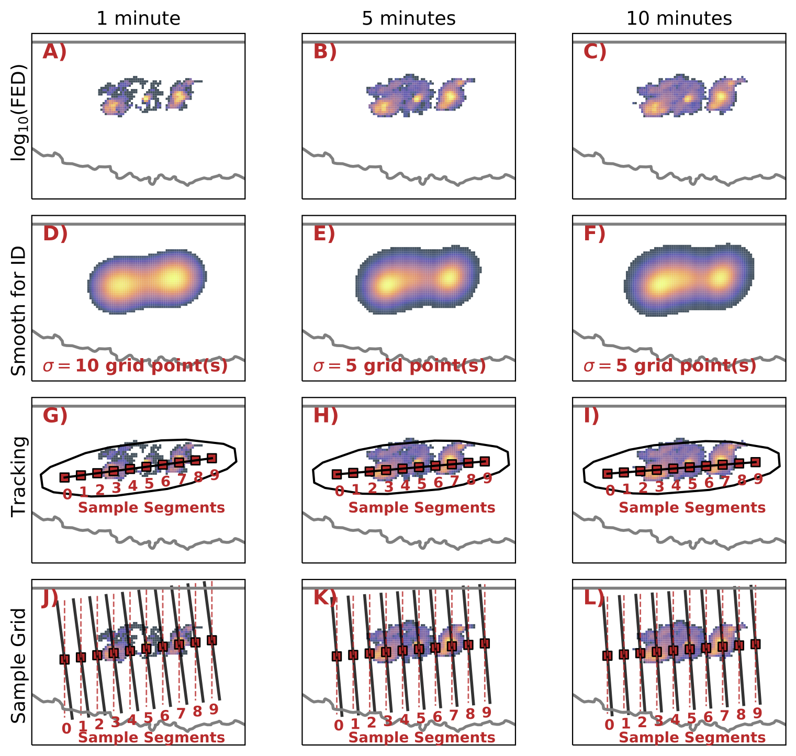

# Lightning Tracking Algorithm (LTR) For Linear Storm Systems

Requirements [outside base installs]:
-------------
           -) numpy
           -) scipy
           -) xarray
           -) pandas
           -) lmatools
           -) xlma-python
           -) cartopy
           -) cmocean
           -) skimage
           -) seaborn
           -) shapely
           -) metpy

Summary:
-------------------------------------
LTR-Lightning Tracking contains the code required to run the LTR and for reproducing the figures shown in Salinas and Chmielewski (2023). The LTR is a storm tracking algorithm based entirely on using lightning data. These lightning data are retrieved from lightning mapping array (LMA) networks; for the example datasets in this repository, data are provided from the Oklahoma LMA. The LTR is employed to track large linear storm systems and to generate sampling grids by which the variability of lightning flash activity may be examined without requiring manual analysis (manually drawing sampling cross sections, etc).

The LTR has two main steps:

   1) LTR Tracking Algorithm: used to tracking linear storm systems using LMA gridded data products (Flash Extent Density). The LTR tracking algorithm has proven useful in consistently tracking large linear FED footprints for more than 3 hours on average.

      - Caveats: tracking fails during periods of time when storms are of mixed-mode phase, or prior to linear consolidation of discrete storm cells.

   2) LTR Sampling: used to sample flash rates and/or other observables within the analysis domain for comparing and documenting their evolution across space and time

Workflow:
-------------------------------------
The LTR follows a linear workflow. This workflow ensures that any user may ingest data from any LMA network for tracking linear storm systems. The workflow is as follows:

   1) Download LMA L2 data: LMA data may be requested and pulled from the NSSL Thredds server

   2) Flash sorting and gridding: The scripts used to generate flash sorting and gridding are provided but not used directly. Instead, they are provided to give the user means by which to run additional analyses on their own. Flash sorting and gridding makes use of pyxlma [xlma-python].
                            - Flash sorting: Using xlma-python, generate single flash sorted files in netcdf format per case. Warning: doing this takes time but makes gridding easier. Flash sorting is done by first filtering flashes with chi2>1, minimum number of stations of 5, and minimum points per flash of 10. All other clustering parameters follow Fuchs et al., (2016).
                            - Flash gridding: Using xlma-python and the flash sorted file(s), generate 2D or 3D gridded products. The script provided generates the flash extent density composites (2d) for use with the LTR. Two OKLMA FED data files are provided (compressed as .gz) for testing the LTR. The files in caseparams directory are used to specify the FED grid spacing, and time intervals. These values are configurable, but as detailed in Salinas and Chmielewski (2023) are generated using either 1 (60s), 5 (300s), or 10 (600s) minute intervals. See the paper for more information of the flash gridding parameters.

   3) Running the LTR: Running the LTR requires the user to open StormTracking_Sampling.ipynb. From this notebook, the following are done:
                            - Flash object (FOB) identification: Includes morphological operations for FOB identification, generating geometry properties, smoothed tracks, and smoothed orientations. The FOB identification is made by using Otsu's threshold in order to provide adaptive threshold with each time frame rather than setting constant thresholding which results in problems with consistent feature tracking through time (Lakshmanan and Smith, 2010).
                            - FOB tracking: Tracking is done concurrent to the FOB identification at each time step using feature labeling.
                            - Ellipse Generalization: generalize storm shape using an ellipse defined with constant dimensions to envelope the entire electrically active linear storm system, and to ensure that the sampling grids maintain constant grid spacing. An ellipse is chosen as it best represents the shape of linear storms.

   4) Sampling Grids:
                            - Sampling grids are generated from the ellipse geometries running through the semi-major axis length. The sampling grid is defined by (n) sample segments and (m) sample points. For the examples used in this repository, 10 sample segments are used each defined by 100 samples. Thus, a 1000 point sampling grid is used to examine flash rate variability through the length and width of linear storm systems, and how the FED varies through its vertical structure.

Purpose:
-----
The main purpose of the LTR is for use in examining how lightning flash activity may be used to proxy the evolution, intensification, and magnitude of cold pools generated by QLCSs (quasi-linear convective systems) during the PERiLS (Propagation, Evolution, Rotation in Linear Storms) field campaign (2022-2023). The objective of using lightning data is to identify possible proxies for what is and what will be happening in the storm and at the surface in terms of the microphysics and thermodynamics leading up to significant weather hazards (e.g., tornados).

Future work:
------
The LTR is still in its early stages. Future work will seeks to implement the following:
              - Multiple feature tracking to capture evolution and storm linearization without needed to skip time frames.
              - Ability to use GLM (geostationary lightning mapper) data for larger coverage of CONUS.

Any questions or concerns about issues or errors in these files, or data useage and access, may be directed to the author at: vicente.salinas@noaa.gov
